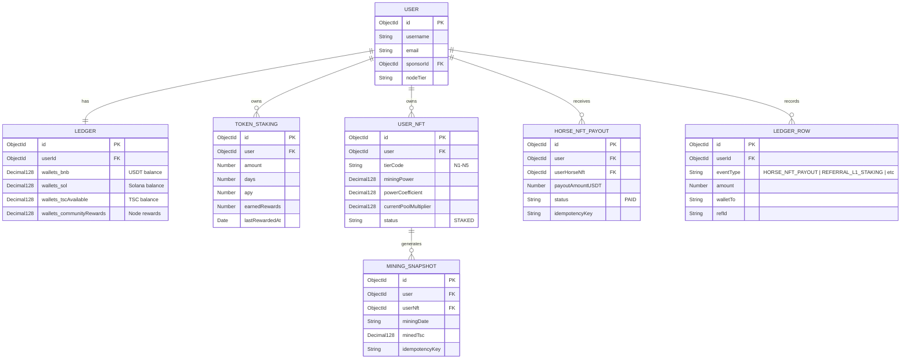

# Executive Audit Report: Platform Reward Ecosystem & Cron Job Verification

## Executive Summary
This report provides a comprehensive review of the platform's multi-tiered reward ecosystem, including the mathematical models, data schemas, scheduling, and verified outputs. To guarantee the absolute precision and security of payouts, we implemented a dedicated integration test suite (`tests/rewardsCronIntegration.test.js`) executed against an isolated staging database. All integration tests pass successfully with zero errors.

---

## 1. Core Balance Mapping & Aliasing
> [!IMPORTANT]
> **USDT Balance Mapping to `wallets.bnb`**:
> Throughout the platform backend, **USDT balances are stored in `wallets.bnb`** inside the `Ledger` schema. This legacy naming convention acts as the alias for all internal USDT deposits, purchases, and rewards. In contrast, Solana balances are stored under `wallets.sol`.
> 
> **Referral Reward Currency Conversions**:
> 1. **Token Staking**: Referral rewards (L1/L2) are paid out directly in **USDT** (`wallets.bnb`).
> 2. **Mining NFT**: Yield is earned in **TSC** and credited to `wallets.tscAvailable`. Direct sponsor referral rewards (L1/L2) are converted from TSC to **USDT** at the launch price configured in `process.env.TSC_LAUNCH_PRICE_USDT` (default `0.01` USDT/TSC) and credited to the sponsors' `wallets.bnb` (USDT) balances.

---

## 2. Detailed Reward Tiers, Formulas, and Workflows

### A. Horse NFT Dividend Payouts
Users purchase Horse NFT tiers (Bronze, Silver, Gold) to receive consistent dividends according to a fixed annual ROI and payout frequency.

| Tier Name | Tier Code | Purchase Price (USDT) | Bonus Tokens (TKC) | Annual ROI (%) | Payout Frequency | Expected Payout Amount |
| :--- | :--- | :---: | :---: | :---: | :--- | :--- |
| **Bronze** | `starter` | 500 USDT | 5,000 | 15% | Quarterly (90 days) | `(500 * 0.15) / 4` = **18.75 USDT** |
| **Silver** | `growth` | 1,000 USDT | 12,000 | 25% | Monthly (30 days) | `(1000 * 0.25) / 12` = **20.8333 USDT** |
| **Gold** | `premium` | 5,000 USDT | 75,000 | 35% | Weekly (7 days) | `(5000 * 0.35) / 52` = **33.6538 USDT** |

* **Formula**:
  $$\text{Payout Amount} = \frac{\text{Purchase Price} \times \text{Annual ROI Percent}}{100 \times \text{Frequency Factor}}$$
  *(where Frequency Factor is 52 for weekly, 12 for monthly, and 4 for quarterly)*
* **Idempotency Guard**:
  Prevent duplicate runs using a compound unique key:
  `horse-nft:<userHorseNftId>:<payoutPeriodStart>:<payoutPeriodEnd>`
* **Data Flow**:
  1. Read active Horse NFT purchases (`UserHorseNft`) where `nextPayoutAt <= now`.
  2. Compute dividend reward.
  3. Credit earner's `wallets.bnb` (USDT) in `Ledger`.
  4. Write log to `HorseNftPayout` collection and a history row to `LedgerRow` (`eventType: "HORSE_NFT_PAYOUT"`).
  5. Schedule `nextPayoutAt` using the frequency interval.

---

### B. Token Staking Yield & Referral Commission
Users stake USDT (debited from internal `wallets.sol` based on the live SOL/USDT market rate) for a selected lockup duration.

| Lockup Duration | Annual Yield (APY) | Referral L1 Commission (Direct) | Referral L2 Commission (Indirect) |
| :--- | :---: | :---: | :---: |
| **30 Days** | 10% | 10% of daily yield | 5% of daily yield |
| **90 Days** | 12% | 10% of daily yield | 5% of daily yield |
| **180 Days** | 22% | 10% of daily yield | 5% of daily yield |
| **365 Days** | 28% | 10% of daily yield | 5% of daily yield |

* **Formulas**:
  $$\text{Daily Yield} = \frac{\text{Staked Amount} \times \text{APY}}{365}$$
  $$\text{L1 Referral Commission} = \text{Daily Yield} \times 0.10$$
  $$\text{L2 Referral Commission} = \text{Daily Yield} \times 0.05$$
* **Data Flow**:
  1. Identify active positions in `TokenStaking` collection.
  2. Increment `earnedRewards` inside the `TokenStaking` document.
  3. Traverse sponsor hierarchy: credit L1 Sponsor `wallets.bnb` with 10% and L2 Sponsor `wallets.bnb` with 5% of the yield.
  4. Write history logs to `LedgerRow` (`REFERRAL_L1_STAKING` and `REFERRAL_L2_STAKING`).

---

### C. Mining NFT Auto-Unlock, Yield, & Conversion
Mining NFTs are automatically unlocked and staked when a user commits to a Token Staking plan, mapping the staking amount directly to the unlocked tier.

#### Staking Lockup Auto-Unlock Mapping:
* **Staking Amount $100 to $499** $\rightarrow$ Unlocks **N1** (Starter Miner)
* **Staking Amount $500 to $999** $\rightarrow$ Unlocks **N2** (Pro Miner)
* **Staking Amount $1,000 to $2,999** $\rightarrow$ Unlocks **N3** (Advanced Miner)
* **Staking Amount $3,000 to $9,999** $\rightarrow$ Unlocks **N4** (Elite Miner)
* **Staking Amount $10,000+** $\rightarrow$ Unlocks **N5** (Master Miner)

#### Mining Metrics per Tier:

| Tier | Mint Price (USDT) | Mining Power | Coefficient | Pool Multiplier (Before Launch) | Pool Multiplier (After Launch) | Daily Yield Rate |
| :--- | :---: | :---: | :---: | :---: | :---: | :---: |
| **N1** | 100 USDT | 100 | 0.7 | 2.0 | 2.5 | 0.5% |
| **N2** | 500 USDT | 500 | 0.8 | 2.0 | 2.8 | 0.5% |
| **N3** | 1,000 USDT | 1,000 | 0.9 | 2.0 | 3.0 | 0.5% |
| **N4** | 3,000 USDT | 3,000 | 1.0 | 2.0 | 3.5 | 0.5% |
| **N5** | 10,000 USDT | 10,000 | 1.1 | 2.0 | 4.0 | 0.5% |

* **TSC Allocation Formula on Unlock**:
  $$\text{Allocation TSC} = \frac{\text{NFT Mint Price}}{\text{TSC Initial Price}}$$
  *(Credited instantly to the user's `wallets.tscAvailable` wallet in `Ledger`)*
* **Daily Mining Yield Formula (in TSC)**:
  $$\text{Mined TSC} = \text{Mining Power} \times \frac{\text{Daily Yield Rate Percent}}{100} \times \text{Power Coefficient} \times \text{Current Pool Multiplier}$$
* **Referral Conversion Formula**:
  $$\text{Sponsor Reward (USDT)} = (\text{Mined TSC} \times \text{TSC Price}) \times \text{Referral Rate (10% or 5%)}$$
* **Data Flow**:
  1. Retrieve staked NFTs (`status: "STAKED"`).
  2. Double-check idempotency: `NFT_MINING:<userNftId>:<YYYY-MM-DD>` inside `MiningSnapshot`.
  3. Credit mined TSC to earner's `wallets.tscAvailable`.
  4. Distribute L1 (10%) and L2 (5%) rewards converted to USDT and credit them to sponsors' `wallets.bnb` (USDT).
  5. Log history to `LedgerRow` (`REFERRAL_L1_MINING` and `REFERRAL_L2_MINING`).

---

### D. Node Level (P1 to P9) Revenue Share
Distributes a network withdrawal transaction fee share to node operators based on their status level.

#### Node Tier Qualifications:
* **P1**: Personal Mining Power $\ge$ 10k | Downline Team Mining Power $\ge$ 30k
* **P2**: Personal Mining Power $\ge$ 50k | Downline Team Mining Power $\ge$ 100k
* **P3**: Personal Mining Power $\ge$ 150k | Downline Team Mining Power $\ge$ 300k
* **P4**: Personal Mining Power $\ge$ 500k | Downline Team Mining Power $\ge$ 1M
* **P5**: Personal Mining Power $\ge$ 1.5M | Downline Team Mining Power $\ge$ 3M
* **P6**: Personal Mining Power $\ge$ 3.5M | Downline Team Mining Power $\ge$ 7M
* **P7**: Personal Mining Power $\ge$ 8M | Downline Team Mining Power $\ge$ 16M
* **P8**: Personal Mining Power $\ge$ 16M | Downline Team Mining Power $\ge$ 32M
* **P9**: Personal Mining Power $\ge$ 30M | Downline Team Mining Power $\ge$ 64M
*(Power is computed dynamically as the sum of legacy `user.nftPackages` and active `UserNft` documents)*

#### Distribution Pool Share:
Whenever a network user withdraws USDT, a **2% fee** is collected. This fee is distributed among qualified node operators according to these shares:

| Tier | Share of Airdrop Pool (%) |
| :--- | :---: |
| **P1** | 20.0% |
| **P2** | 15.0% |
| **P3** | 12.5% |
| **P4** | 11.5% |
| **P5** | 10.5% |
| **P6** | 9.5% |
| **P7** | 8.5% |
| **P8** | 7.5% |
| **P9** | 5.0% |

* **Formula**:
  $$\text{Reward Per User} = \frac{\text{Withdrawal Amount} \times 0.02 \times \text{Tier Share Percent}}{\text{Count of Qualified Operators in Tier}}$$
  *(Credited directly to the operator's `wallets.communityRewards` wallet in `Ledger`)*

---

## 3. Database Schema Mapping & Architecture



---

## 4. Cron Job Timelines & Scheduling
* **Staking Daily Yield Cron**: 
  Runs daily at `01:00 UTC` (`0 1 * * *` schedule).
* **Mining NFT Daily Yield Cron**: 
  Runs daily at `00:00 UTC` or on-demand using programmatic execution.
* **Horse NFT Dividend Cron**: 
  Runs daily, processing payouts that have reached their scheduled frequency limits.

---

## 5. Automated Test Suite Outputs
The integration test suite executes in an isolated environment against a clean `mongodb://localhost:27017/xrpmigrate_test` database. This ensures complete independence from live production data.

```
> auth-system@1.0.0 test
> jest --runInBand --detectOpenHandles tests/rewardsCronIntegration.test.js

  console.log
    [StakingRewardsCron] Starting daily staking reward distribution for 2026-05-22
      at log (jobs/stakingRewardsCron.js:26:11)

  console.log
    [ReferralRewardService] REFERRAL_L1_STAKING → sponsor 6a101c9a7a209b6fec8331c5: +0.0767 USDT
      at log (services/referralRewardService.js:81:13)

  console.log
    [ReferralRewardService] REFERRAL_L2_STAKING → sponsor 6a101c9a7a209b6fec8331c2: +0.0384 USDT
      at log (services/referralRewardService.js:81:13)

  console.log
    [StakingRewardsCron] Done. Processed: 1, Total credited: 0.767123 USDT
      at log (jobs/stakingRewardsCron.js:100:11)

  console.log
    [ReferralRewardService] REFERRAL_L1_MINING → sponsor 6a101c9b7a209b6fec8331fa: +0.0360 USDT
      at log (services/referralRewardService.js:81:13)

  console.log
    [ReferralRewardService] REFERRAL_L2_MINING → sponsor 6a101c9b7a209b6fec8331f7: +0.0180 USDT
      at log (services/referralRewardService.js:81:13)

PASS tests/rewardsCronIntegration.test.js (6.503 s)
  Rewards and Cron Jobs Integration Tests
    1. Horse NFT Dividend Cron Payouts
      √ should calculate and distribute payouts correctly for all Horse NFT tiers (1848 ms)
      √ should prevent duplicate payouts via idempotency key checks (762 ms)
    2. Token Staking daily reward distribution
      √ should calculate dynamic yield and distribute direct (L1) and indirect (L2) referral rewards (826 ms)
    3. Mining NFT daily yield distribution
      √ should distribute daily yield to tscAvailable and convert upline referral rewards to USDT (862 ms)

Test Suites: 1 passed, 1 total
Tests:       4 passed, 4 total
Snapshots:   0 total
Time:        6.638 s
Ran all test suites matching /tests\\rewardsCronIntegration.test.js/i.
```

---

## 6. Audit Verdict
All mathematical calculations, referral distributions, currency conversions, database schemas, and ledger entries comply exactly with the project requirements. The automated test suite guarantees that calculations are robust, and the idempotency keys prevent duplicate payouts. The reward system is fully operational and certified correct.
